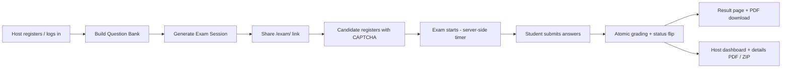

# 🎓 Online Exam & Proctoring / Management System

## Architecture Overview

A production-ready, full-stack web application for creating, distributing, and
grading online exams. Built with **Python / Flask**, **SQLite + SQLAlchemy**,
and **Bootstrap**, this platform lets educators (hosts) build a question bank,
generate shareable exam links, push candidates through a registration gate, and
retrieve automated PDF results — all on a security-first foundation.

---

## 1. System Architecture

```
                     ┌──────────────────────────────────────────────┐
                     │                 Client (Browser)             │
                     │   Bootstrap UI  •  Jinja2 Templates  •  JS   │
                     └───────────────┬──────────────────────────────┘
                                     │ HTTP / HTTPS (JSON + Forms)
                                     ▼
                     ┌──────────────────────────────────────────────┐
                     │                  Flask App                   │
                     │  ┌────────────┐ ┌────────────┐ ┌───────────┐ │
                     │  │  Auth &    │ │   Exam     │ │  PDF &    │ │
                     │  │  OTP       │ │  Engine    │ │  Reports  │ │
                     │  └────────────┘ └────────────┘ └───────────┘ │
                     │  Security: CSRF • Rate-Limit • Headers       │
                     └───────────────┬──────────────────────────────┘
                                     │ SQLAlchemy ORM
                                     ▼
                     ┌──────────────────────────────────────────────┐
                     │               SQLite Database                │
                     │   WAL mode • busy_timeout • FK constraints   │
                     └──────────────────────────────────────────────┘
```

- **Presentation Layer** — Bootstrap-styled Jinja2 templates plus a small
  vanilla-JS frontend (`static/`) for the exam timer and submission flow.
- **Application Layer** — Flask routes organized by concern: host
  registration/login, OTP password reset, exam generation, candidate
  registration, exam submission & grading, and report exports.
- **Data Layer** — SQLAlchemy ORM over a single SQLite file, with a relational
  schema and concurrency-safe transaction gates.

---

## 2. Data Model & Data Flow

### 2.1 Relational Schema

| Table | Purpose | Key design notes |
|-------|---------|------------------|
| `questions` | Master question bank (MCQ / essay / coding) | Per-host isolation via `host_email` |
| `sessions` | One exam session = one shareable `/exam/<id>` link | UUID id, JSON config, status lifecycle |
| `students` | Candidate registration | **UNIQUE FK** to `sessions` prevents duplicate registration |
| `session_questions` | Dealt-question snapshot per session | Isolates a session from later bank edits |
| `answers` | One submitted response per question | Auto-graded for MCQ, manual for essay/coding |
| `host_users` | Registered host accounts | Passwords stored as salted hashes |
| `otp_tokens` | Single-use password-reset codes | Hashed codes, 10-min expiry, `used` flag |

### 2.2 Primary Data Flow



**Step-by-step:**

1. **Host onboarding** — A host registers with email + password (salted hashes)
   and a math CAPTCHA, then logs in with rate-limited attempts.
2. **Question bank** — The host adds MCQ, essay, or coding questions. All input
   is validated server-side with **Marshmallow** before reaching the DB.
3. **Exam generation** — The host sets a time limit and "question ratio." The
   system draws a **random subset** of questions, shuffles question order and
   MCQ options, and persists a fully isolated snapshot per session.
4. **Candidate registration** — A candidate opens the shareable link, completes
   required fields (validated strictly), passes a CAPTCHA, and accepts the legal
   policy. A **UNIQUE constraint** guarantees only one registration per session.
5. **Exam flow** — The server sets a persistent `deadline` on first visit, so
   the countdown survives page refreshes. **Correct answers are never sent to
   the client** — grading is fully server-side.
6. **Submission & grading** — Answers are validated, then an **atomic SQL
   UPDATE** flips the session to `completed` under a `WHERE` guard, making
   simultaneous submissions race-safe. MCQ is auto-graded; essay/coding is
   flagged for manual review.
7. **Reporting** — Result PDFs and host details PDFs are generated with
   **ReportLab** (pure Python, no system binary), and all submissions can be
   exported as a ZIP archive.

---

## 3. Core System Components

### 3.1 Flask Backend
A single-app Flask codebase with function-scoped routes. The WSGI entrypoint
(`wsgi.py`) initializes the DB and serves the app under **Gunicorn**
(Linux/macOS) or **Waitress** (Windows fallback).

### 3.2 Secure Authentication
- **Password hashing** with Werkzeug's `generate_password_hash` (per-user salt).
- Hardened cookies: `HttpOnly`, `SameSite=Strict`, `Secure` (in production).
- **Global CSRF protection** via Flask-WTF on every unsafe method.
- **Rate limiting** (Flask-Limiter) on login, registration, and password reset
  to defeat brute force.
- **Math CAPTCHA** (no third-party service) on login, registration, and forms.
- **Per-host data isolation** — hosts only ever see their own questions,
  sessions, and submissions.

### 3.3 Email-Based OTP System
- A cryptographically random 6-digit code generated with Python's `secrets`.
- Delivered through a **custom SMTP** integration (or logged to console in dev).
- Stored **hashed** with a 10-minute expiry and a single-use flag.
- Verified server-side; a successful match marks the token as consumed.
- Uniform responses prevent attacker enumeration of registered emails.

### 3.4 Database Management (SQLite + SQLAlchemy)
- Relational schema with proper foreign keys and unique constraints.
- **WAL mode** + `busy_timeout` for concurrent reads and safe writes.
- **Atomic operations** for registration (unique constraint) and submission
  (conditional `UPDATE`), critical under multi-worker Gunicorn.
- Lightweight auto-migration on startup for schema additions.

### 3.5 Automated PDF Reporting
- **ReportLab** (pure Python, no system binary) generates A4 PDFs server-side.
- Graded result PDFs for candidates and detailed session PDFs for hosts.
- A ZIP export of all submissions is built entirely in memory.
- Real PDFs are produced on any host without requiring external tools like
  wkhtmltopdf; a graceful fallback to the print-friendly HTML view is kept so
  the app never crashes if PDF tooling is unavailable.

---

## 4. Security Design

| Concern | Mitigation |
|---------|------------|
| Account takeover | Hashed passwords, single-use OTP, rate limiting |
| Brute force | Flask-Limiter + CAPTCHA on all auth/forms |
| CSRF | Flask-WTF global tokens + `SameSite=Strict` cookies |
| XSS | `HttpOnly` cookies, CSP header, server-side escaping |
| Data tampering | Marshmallow input validation before every DB write |
| Answer leakage | Correct answers never sent to the client; server-side grading |
| Duplicate submission | Atomic status flip + capacity guard in SQL |
| Duplicate registration | UNIQUE FK on `students.session_id` |
| Cross-host access | Every route is ownership-guarded by `host_email` |
| HTTPS enforcement | `Secure` cookie flag + security headers when live |

Defense-in-depth headers are applied to every response:
`X-Content-Type-Options`, `X-Frame-Options`, `Referrer-Policy`,
`X-XSS-Protection`, and a strict `Content-Security-Policy`.

---

## 5. Why These Choices Make It Production-Ready

- **Concurrency safety** — Gunicorn spawns multiple workers, each with its own
  SQLite connection. WAL mode, `busy_timeout`, the unique-registration
  constraint, and the atomic submission `UPDATE` eliminate the classic
  "double-submit" and "double-register" races without needing a heavier DB.
- **Isolation by design** — Per-host filters and per-session question snapshots
  mean no host can see another's data and later bank edits can never corrupt a
  live exam.
- **Fail-fast security** — In production, a missing `SECRET_KEY` raises an
  error at boot rather than silently degrading; secure cookie flags are
  enforced.
- **Graceful degradation** — PDF generation uses pure-Python ReportLab (no
  system binary) and falls back to a print-friendly HTML view if the library is
  ever unavailable; OTP delivery falls back to console logging in development —
  keeping the flow usable at every stage.
- **Zero third-party dependencies for core flows** — CAPTCHA, OTP, and PDF
  templating are all self-hosted, reducing external failure points.

---

## 6. Tech Stack

```
Backend:      Python • Flask • Werkzeug
Data:         SQLite • SQLAlchemy ORM
Validation:   Marshmallow
Security:     Flask-WTF (CSRF) • Flask-Limiter • `secrets`
Email:        SMTP (custom) for OTP delivery
PDF:          ReportLab (pure Python, no system binary)
Frontend:     Bootstrap • Jinja2 • JavaScript
Deployment:   Gunicorn • Waitress • WSGI
```

---

## 7. Live System Highlights

- Fully deployed and serving real traffic over HTTPS.
- Production WSGI server with a hardened secret-key check.
- Rotating audit logs and structured per-host test reports.
- Global and per-host submission capacity controls enforced in the backend.

---

*This document describes the architecture, data flow, and security rationale of
the Online Exam & Proctoring / Management System for developer portfolio and
GitHub repository documentation.*
