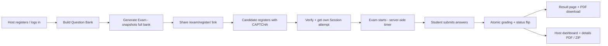

# 🎓 VeloTest — Online Exam & Assessment Platform

## Architecture Overview

**VeloTest** is a production-ready, full-stack web application for creating,
distributing, and grading online exams. Built with **Python / Flask**, **SQLite +
SQLAlchemy**, and **Bootstrap**, it lets educators (hosts) build a question bank,
generate a single *reusable* shareable exam link, push any number of candidates
through a secure registration gate, auto-grade every multiple-choice answer, and
export PDF results — all on a security-first foundation.

This document describes the structural design: the **backend routing**, the
**relational database models** (`HostUser`, exams, questions, student attempts), and
the **secure front-end template integration**.

---

## 1. System Architecture

```
                     ┌──────────────────────────────────────────────┐
                     │                 Client (Browser)             │
                     │   Bootstrap UI  •  Jinja2 Templates  •  JS   │
                     └───────────────┬──────────────────────────────┘
                                     │ HTTP / HTTPS (JSON + Forms)
                                     ▼
                     ┌──────────────────────────────────────────────┐
                     │                  Flask App                   │
                     │  ┌────────────┐ ┌────────────┐ ┌───────────┐ │
                     │  │  Auth &    │ │   Exam     │ │  PDF &    │ │
                     │  │  OTP       │ │  Engine    │ │  Reports  │ │
                     │  └────────────┘ └────────────┘ └───────────┘ │
                     │  Security: CSRF • Rate-Limit • Headers       │
                     └───────────────┬──────────────────────────────┘
                                     │ SQLAlchemy ORM
                                     ▼
                     ┌──────────────────────────────────────────────┐
                     │               SQLite Database                │
                     │   WAL mode • busy_timeout • FK constraints   │
                     └──────────────────────────────────────────────┘
```

- **Presentation Layer** — Bootstrap-styled Jinja2 templates plus a small vanilla-JS
  frontend (`static/exam.js`) that drives the exam countdown and submission flow.
- **Application Layer** — Flask routes organized by concern: host
  registration/login, OTP password reset, exam generation, candidate registration,
  exam submission & grading, and report exports.
- **Data Layer** — SQLAlchemy ORM over a single SQLite file, with a relational schema
  and concurrency-safe transaction gates.

---

## 2. Backend Routing

The backend is a single Flask app defined in `app.py` and served via the WSGI
entrypoint (`wsgi.py`) under **Gunicorn** (Linux/macOS) or **Waitress** (Windows).
Host-only routes are protected by the `login_required` decorator; nearly all unsafe
(`POST`) routes also carry rate limits via Flask-Limiter.

### 2.1 Public / entry-point routes

| Method | Route | Purpose |
|--------|-------|---------|
| GET | `/` | Root — dashboard if logged in, otherwise the welcome page |
| GET | `/privacy` | Public privacy policy & liability disclaimer |
| GET | `/favicon.ico` | Site logo served as the browser favicon |

### 2.2 Student (candidate) routes

| Method | Route | Purpose |
|--------|-------|---------|
| GET/POST | `/exam/register/<exam_id>` | **Universal registration portal** — the shared entry point for an Exam; every candidate who registers here gets their own `Session` |
| GET/POST | `/exam/verify/<exam_id>` | Post-registration verification step (grants the per-session auth marker) |
| GET | `/exam/<session_id>` | Candidate exam page — server-anchored timer, public questions only (no answers) |
| GET | `/exam/<session_id>/time` | JSON time-sync endpoint that re-anchors the countdown to the server clock (tamper-proof) |
| GET/POST | `/exam/<session_id>/register`, `/register/<session_id>` | Legacy single-session registration gate |
| POST | `/exam/<session_id>/submit` | Validate + persist answers, then **algorithmically grade** (auto-grade MCQ, flag essay/coding for manual review) |

### 2.3 Host routes (all behind `login_required`)

| Method | Route | Purpose |
|--------|-------|---------|
| GET/POST | `/host/register` | Host account creation (salted password hash + CAPTCHA, rate-limited) |
| GET/POST | `/host/login` | Host login (rate-limited) |
| POST | `/host/logout` | End the host session |
| GET/POST | `/host/forgot-password` | Request a timed OTP for password reset |
| GET/POST | `/host/reset-password` | Redeem OTP and set a new password |
| GET | `/host` | Host dashboard — question bank, generated exams, attempts overview |
| POST | `/host/question` | Add a question to the master bank |
| POST | `/host/question/<qid>/delete` | Delete one bank question |
| POST | `/clear_questions` | Clear **all** of the current host's questions |
| POST | `/host/clear-submissions` | Clear submissions / exam sessions (bank untouched) |
| POST | `/host/generate` | **Generate an Exam** — atomically snapshot the full bank into `exam_questions` and create the shareable link |
| GET | `/host/exam/<exam_id>/attempts` | Per-exam attempts view (each registered candidate listed) |
| GET | `/host/session/<session_id>` | Per-attempt session details |
| GET | `/host/session/<session_id>/details.pdf` | Session report as a generated PDF |
| POST | `/host/exam/<exam_id>/delete` | Delete an exam and all of its attempts |
| GET | `/host/download-all.zip` | Export all of the host's submissions as a ZIP |

---

## 3. Data Model & Data Flow

### 3.1 Relational Schema

| Table | Model | Purpose | Key design notes |
|-------|-------|---------|------------------|
| `host_users` | `HostUser` | Registered host / teacher / organizer | `email` unique; `password_hash` salted via Werkzeug; `name` |
| `otp_tokens` | `OtpToken` | One-time password-reset codes | `code_hash` (hashed), 10-min `expires_at`, single-use `used` flag |
| `questions` | `Question` | Master question bank (MCQ / essay / coding) | `id` = `q_<hex>`; per-host isolation via `host_email`; `type`, `text`, `options`, `correct_index` |
| `exams` | `Exam` | The **universal, reusable entry point** | `id` = raw UUID hex (the shareable token); `config` JSON carries title, time-limit, ratio, capacity, custom registration fields; `host_email` for ownership |
| `exam_questions` | `ExamQuestion` | Full question-bank **snapshot** dealt to an Exam at generation time | Isolates the exam from later bank edits; each student attempt re-samples from this snapshot |
| `sessions` | `Session` | **One per-student attempt** | `id` = UUID hex; `exam_id` FK → `exams`; `host_email`; `config` JSON; status lifecycle (`pending → started → completed`); server-side `deadline`; `score`/`total_selected` for graded attempts |
| `students` | `Student` | Candidate registration (1:1 with a Session) | **UNIQUE FK** on `session_id` prevents duplicate registration; custom fields JSON; `agreed_to_policy` audit trail |
| `session_questions` | `SessionQuestion` | Per-attempt dealt-question snapshot (isolated from the bank) | `position`, `type`, `text`, shuffled `options`, recomputed `correct_index` |
| `answers` | `Answer` | One submitted response per question | `response` JSON (int for MCQ, string for essay/coding); `correct` bool (MCQ) / `None` (manual); `position` matches `SessionQuestion` |

### 3.2 Primary Data Flow



**Step-by-step:**

1. **Host onboarding** — A host registers with email + password (salted hashes)
   behind a math CAPTCHA, then logs in with rate-limited attempts.
2. **Question bank** — The host adds MCQ, essay, or coding questions. All input is
   validated server-side with **Marshmallow** before reaching the DB, and catalogued
   under the host's isolated `host_email`.
3. **Exam generation** — The host sets a title, time limit, and "question ratio," then
   generates an **Exam**. In a single transaction the system snapshots the *entire*
   bank into `exam_questions` and produces one reusable link —
   `/exam/register/<exam_id>`.
4. **Candidate registration** — Any number of students open the same link. Each
   completes the (optionally custom) required fields, passes a CAPTCHA, and accepts the
   legal policy. A **UNIQUE constraint** on `students.session_id` guarantees only one
   registration per attempt. Each student receives **their own isolated `Session`**, so
   100+ candidates can take the same exam concurrently without overriding one another.
5. **Dealing questions** — For each attempt, `randomize_questions()` re-samples `ratio`
   random questions from the exam's immutable `exam_questions` snapshot, shuffles the
   order, deep-copies each question, and shuffles MCQ options while recomputing
   `correct_index`. **Correct answers are never sent to the client.**
6. **Exam flow** — The server persists an absolute UTC `deadline` on first visit, so
   the countdown survives page refreshes; a polling endpoint re-anchors the clock to
   the server to defeat browser-clock tampering.
7. **Submission & grading** — Answers are validated (Marshmallow), then an **atomic
   SQL UPDATE** flips the session to `completed` under a `WHERE` guard — making
   simultaneous submissions race-safe. **Algorithmic grading** auto-scores every MCQ
   against `correct_index`; essay/coding answers are saved verbatim and flagged for
   manual review.
8. **Reporting** — Result PDFs and host details PDFs are generated with **ReportLab**
   (pure Python, no system binary), and all submissions can be exported as a ZIP.

---

## 4. Core System Components

### 4.1 Flask Backend
A single-app Flask codebase with function-scoped routes. The WSGI entrypoint
(`wsgi.py`) initializes the schema on boot and serves the app under **Gunicorn**
(Linux/macOS) or **Waitress** (Windows). `app.py` is responsible for config, routing,
business logic, and PDF generation; `models.py` holds the ORM models and serializers;
`schemas.py` holds Marshmallow validation.

### 4.2 Secure Authentication
- **Password hashing** with Werkzeug's `generate_password_hash` (per-user salt).
- Hardened cookies: `HttpOnly`, `SameSite=Strict`, `Secure` (in production).
- **Global CSRF protection** via Flask-WTF on every unsafe method.
- **Rate limiting** (Flask-Limiter) on login, registration, and password reset to
  defeat brute force.
- **Math CAPTCHA** (no third-party service) on login, registration, and forms.
- **Per-host data isolation** — hosts only ever see their own questions, exams, and
  submissions.

### 4.3 Email-Based OTP System
- A cryptographically random 6-digit code generated with Python's `secrets`.
- Delivered through a **custom SMTP** integration (or logged to console in dev).
- Stored **hashed** with a 10-minute expiry and a single-use flag; verified
  server-side and consumed on success.
- Uniform responses prevent attacker enumeration of registered emails.

### 4.4 Database Management (SQLite + SQLAlchemy)
- Relational schema with proper foreign keys and unique constraints (see §3.1).
- **WAL mode** + `busy_timeout` for concurrent reads and safe writes under
  multi-worker Gunicorn.
- **Atomic operations** for registration (unique constraint) and submission
  (conditional `UPDATE`), eliminating double-register and double-submit races.
- Lightweight auto-migration on startup for schema additions.

### 4.5 Automated PDF Reporting
- **ReportLab** (pure Python, no system binary) generates A4 PDFs server-side.
- Graded result PDFs for candidates and detailed session PDFs for hosts, plus a ZIP
  export built entirely in memory.
- A graceful fallback to the print-friendly HTML view means the app never crashes if
  PDF tooling is unavailable.

---

## 5. Secure Front-End Template Integration

Templates live in `templates/` (Jinja2) with shared assets in `static/`
(`style.css`, `exam.js`). The front end is deliberately a *thin, untrusted* renderer:
all security-relevant logic — validation, grading, timers, and access control — lives
server-side. Key integration points:

| Concern | How the templates integrate securely |
|---------|--------------------------------------|
| **No answer leakage** | The exam page (`exam.html`) is rendered from `public_questions`, which include only `id`, `type`, `text`, and `options` — `correct_index` and answer keys are stripped server-side before rendering. |
| **CSRF on every form** | Every `<form>` embeds `{{ csrf_token() }}` as a hidden field; JSON routes submit it via the `X-CSRFToken` header. Flask-WTF rejects unsafe requests without a valid token. |
| **Server-anchored countdown** | `exam.html` receives `deadline_unix` / `server_now_unix` and `static/exam.js` polls `/exam/<session_id>/time` with `fetch`, so client clock/refresh tampering cannot extend time. |
| **Registration gate** | Session auth is enforced via `session["auth_<session_id>"]`; unregistered/unauthorized visits to `/exam/<session_id>` are redirected to the registration portal — no page is ever rendered for unknown/invalid ids. |
| **Dynamic forms** | The host's custom registration fields are generated with `slugify()` into safe HTML `name` keys and rendered from `register.html`; strict server-side regex (alphabetic name, 10-digit phone) validates regardless of client. |
| **Jinja escaping** | All host/student-supplied text is auto-escaped by Jinja2, and a strict `Content-Security-Policy` (self-only scripts/styles, `frame-ancestors 'self'`) plus `HttpOnly` cookies mitigate XSS. |
| **Graceful JSON failure** | `static/exam.js` only ever receives JSON from `/submit`; the route wraps grading in a try/except so errors never escape as raw HTML pages. |

### 5.1 Template inventory

- **Public / marketing:** `welcome.html`, `privacy.html`
- **Host auth:** `host_register.html`, `host_register_verify.html`,
  `host_login.html`, `host_login_verify.html`, `host_forgot.html`, `host_reset.html`
- **Host dashboard:** `host.html`, `exam_attempts.html`, `details.html`,
  `details_pdf.html`
- **Candidate flow:** `register.html`, `exam_verify.html`, `exam.html`,
  `result.html`, `result_pdf.html`

---

## 6. Security Design

| Concern | Mitigation |
|---------|------------|
| Account takeover | Hashed passwords, single-use OTP, rate limiting, CAPTCHA |
| Brute force | Flask-Limiter + CAPTCHA on all auth/forms |
| CSRF | Flask-WTF global tokens + `SameSite=Strict` cookies |
| XSS | `HttpOnly` cookies, CSP header, Jinja auto-escaping |
| Data tampering | Marshmallow input validation before every DB write |
| Answer leakage | Correct answers never sent to the client; server-side grading |
| Duplicate submission | Atomic status flip + capacity guard in SQL |
| Duplicate registration | UNIQUE FK on `students.session_id` |
| Timer cheating | Server-persisted `deadline` + time-sync endpoint + deadline check on submit |
| Cross-host access | Every route is ownership-guarded by `host_email` |
| HTTPS enforcement | `Secure` cookie flag + security headers when live |

Defense-in-depth headers are applied to every response via `@app.after_request`:
`X-Content-Type-Options: nosniff`, `X-Frame-Options: SAMEORIGIN`,
`Referrer-Policy`, `X-XSS-Protection`, and a strict `Content-Security-Policy`
(self-only with a pinned CDN allow-list for Bootstrap assets).

---

## 7. Why These Choices Make It Production-Ready

- **Concurrency safety** — WAL mode, `busy_timeout`, the unique-registration
  constraint, and the atomic submission `UPDATE` eliminate the classic
  "double-submit" and "double-register" races without needing a heavier DB.
- **Isolation by design** — Per-host filters, per-exam bank snapshots, and
  per-attempt question snapshots mean no host can see another's data, and later bank
  edits can never corrupt a live exam or attempt.
- **Scale through a single link** — One `Exam` can serve as many students as the
  host opens it to; each gets an isolated `Session`, so hundreds of concurrent
  attempts never collide.
- **Fail-fast security** — In production, a missing `SECRET_KEY` raises an error at
  boot rather than silently degrading; secure cookie flags are enforced.
- **Graceful degradation** — PDF generation uses pure-Python ReportLab and falls back
  to a print-friendly HTML view; OTP delivery falls back to console logging in dev.
- **Zero third-party dependencies for core flows** — CAPTCHA, OTP, and PDF templating
  are all self-hosted, reducing external failure points.

---

## 8. Tech Stack

```
Backend:      Python • Flask • Werkzeug
Data:         SQLite • SQLAlchemy ORM
Validation:   Marshmallow
Security:     Flask-WTF (CSRF) • Flask-Limiter • secrets
Email:        SMTP (custom) for OTP delivery
PDF:          ReportLab (pure Python, no system binary)
Frontend:     Bootstrap • Jinja2 • JavaScript
Deployment:   Gunicorn • Waitress • WSGI
```

---

## 9. Live System Highlights

- Fully deployed and serving real traffic over HTTPS.
- Production WSGI server with a hardened secret-key check.
- Rotating audit logs and structured per-host test reports.
- Global and per-host submission capacity controls enforced in the backend.

---

*This document describes the architecture, data flow, and security rationale of the
VeloTest online exam & assessment platform for developer portfolio and GitHub
repository documentation. See `README.md` for setup, deployment, and configuration
instructions.*